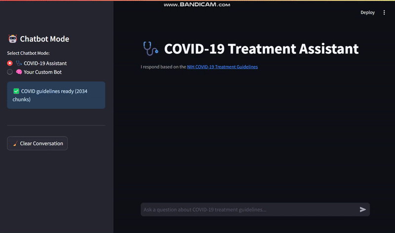

# 🤖 Dual Mode RAG Chatbot
### *Intelligent Document Q&A with Context-Aware Responses*


> **🎯 Quick Demo**: *Upload a PDF → Ask questions → Get intelligent, source-cited answers in seconds*

## 📹 Live Demo


## 🚀 The best part?

**Two Intelligent Modes in One App:**
- **🩺 COVID-19 Assistant**: Pre-loaded with NIH treatment guidelines
- **🧠 Custom Document Bot**: Upload your own PDFs/docs for instant Q&A

**Key Features That Impress:**
- ⚡ **Real-time RAG**: Semantic search + GPT responses with conversation memory
- 📚 **Smart Citations**: Every answer includes source page references
- 🧠 **Context Awareness**: Remembers conversation history for follow-up questions
- 📁 **Multi-format Support**: PDF, TXT, Markdown files
- 🎨 **Clean UI**: Intuitive Streamlit interface with mode switching
- 💾 **Persistent Storage**: ChromaDB vector database with session management

## 🛠️ Technical Architecture

```
📄 Documents → 🔄 Text Splitting → 🧮 Embeddings → 🗃️ ChromaDB
                                                        ↓
🤖 LLM Response ← 📝 Prompt Engineering ← 🔍 Semantic Search
```

**Tech Stack:**
- **Backend**: Python, LangChain, ChromaDB
- **Embeddings**: HuggingFace (all-MiniLM-L6-v2)
- **LLM**: OpenAI GPT-3.5-turbo via OpenRouter
- **Frontend**: Streamlit
- **Vector Store**: ChromaDB with cosine similarity

## ⚡ Quick Start

### 1. Clone & Install
```bash
git clone https://github.com/fomativeh/RAG-Chatbot.git
cd RAG-Chatbot
pip install -r requirements.txt
```

### 2. Environment Setup
Create `.env` file:
```env
OPENROUTER_API_KEY=your_openrouter_api_key_here
OPENROUTER_BASE_URL=https://openrouter.ai/api/v1
COVID_DOC_URL=https://www.ncbi.nlm.nih.gov/books/NBK570371/pdf/Bookshelf_NBK570371.pdf
```

### 3. Launch
```bash
streamlit run app.py
```

### 4. Usage Options

**Option A - COVID Mode**: 
- Add PDF files to `data/covid_docs/` directory
- Select "COVID-19 Assistant" mode
- Start asking medical guideline questions

**Option B - Custom Mode**:
- Select "Your Custom Bot" mode  
- Upload PDFs via the sidebar
- Ask questions about your documents

## 🎯 Core Features Breakdown

### 🔍 **Intelligent Retrieval**
- Semantic search using HuggingFace embeddings
- Top-K document retrieval (configurable)
- Metadata preservation for accurate citations

### 💬 **Conversation Memory**
- Maintains context across multiple exchanges
- Configurable conversation history depth
- Smart prompt engineering with context injection

### 📊 **Document Processing**
- Recursive text splitting for optimal chunks
- Multi-format support (PDF, TXT, MD)
- Automatic metadata extraction (source, page numbers)

### 🗄️ **Data Management**
- Persistent ChromaDB storage
- Session-based collections for uploaded files
- Automatic cleanup and error handling

## 📋 Requirements

```txt
streamlit>=1.28.0
langchain>=0.1.0
langchain-openai>=0.0.5
langchain-community>=0.0.13
chromadb>=0.4.15
sentence-transformers>=2.2.2
PyPDF2>=3.0.1
python-dotenv>=1.0.0
requests>=2.31.0
```

## 🎨 UI/UX Highlights

- **Mode Switching**: Toggle between COVID and custom document modes
- **File Upload**: Drag-and-drop interface with progress indicators  
- **Real-time Status**: Loading spinners, success/error messages
- **Citation Display**: Source references with page numbers
- **Conversation Management**: Clear chat functionality
- **Responsive Design**: Clean, professional Streamlit interface

## 🔧 Advanced Configuration

### Custom Prompt Templates
Modify prompts in `/prompts/` directory:
- `covid_assistant_prompt.txt` - COVID mode system prompt
- `custom_bot_prompt.txt` - Custom document mode prompt

